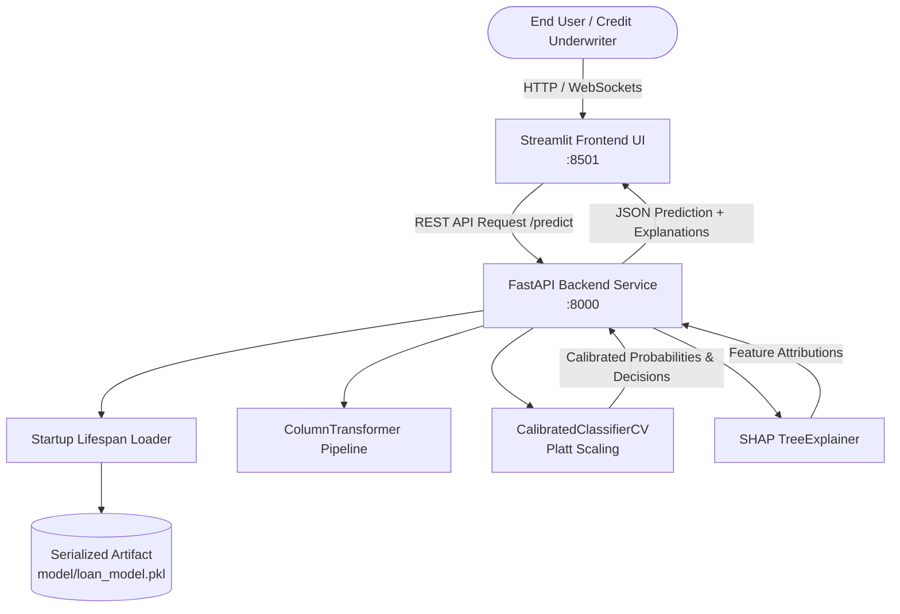

# 💳 Explainable Credit Risk Intelligence Platform

Production-ready machine learning system for calibrated loan default risk assessment and transparent decision explainability using **FastAPI**, **Streamlit**, **Scikit-Learn**, and **SHAP (SHapley Additive exPlanations)**.

---

## 🏛️ System Architecture



---

## 📁 Repository Directory Structure

```text
ml-credit-risk/
├── .github/
│   └── workflows/
│       └── ci.yml                 # GitHub Actions automated CI testing
├── backend/                       # Production FastAPI Service
│   ├── app/
│   │   ├── __init__.py
│   │   ├── main.py                # FastAPI app, CORS, timing middleware, lifespans
│   │   ├── core/
│   │   │   ├── __init__.py
│   │   │   └── config.py          # Dynamic environment configuration
│   │   ├── api/
│   │   │   ├── __init__.py
│   │   │   ├── router.py          # API router aggregation
│   │   │   └── v1/
│   │   │       ├── router.py
│   │   │       └── endpoints/
│   │   │           ├── health.py  # Health and diagnostic checks
│   │   │           └── predict.py # Inference & SHAP attribution endpoint
│   │   ├── schemas/
│   │   │   ├── __init__.py
│   │   │   └── loan.py            # Pydantic validation schemas
│   │   └── services/
│   │       ├── __init__.py
│   │       └── model_service.py   # Model artifact loader, cache & inference engine
│   ├── tests/
│   │   ├── __init__.py
│   │   └── test_api.py            # Automated integration & unit tests
│   ├── .env.example
│   ├── Dockerfile
│   ├── requirements.txt
│   └── vercel.json                # Optional Vercel serverless deployment config
├── frontend/                      # Production Streamlit Application
│   ├── .streamlit/
│   │   └── config.toml            # Custom theme (dark mode, typography, colors)
│   ├── app.py                     # Interactive underwriting dashboard
│   ├── .env.example
│   ├── Dockerfile
│   └── requirements.txt
├── ml/                            # Model Training & Pipeline Tools
│   ├── train.py                   # Parameterized training pipeline with compression
│   ├── evaluate.py                # Standalone model evaluation script
│   └── requirements.txt
├── model/
│   ├── loan_model.pkl             # Serialized pipeline & SHAP explainer
│   └── README.md                  # Model cards, versioning & Git LFS instructions
├── .dockerignore
├── .gitignore
├── docker-compose.yml             # Full-stack multi-container orchestration
├── run.py                         # Single-command launcher for local development
└── README.md
```

---

## ⚡ Quick Start (Local Development)

### 1. Prerequisites
- Python 3.10+ (tested with Python 3.11 / 3.13)
- Pip package manager

### 2. Clone and Setup Environment
```bash
# Clone the repository
git clone <your-repo-url>
cd ml-credit-risk

# Create and activate virtual environment
python -m venv venv

# Windows:
venv\Scripts\activate

# Linux / macOS:
source venv/bin/activate

# Install dependencies
pip install -r backend/requirements.txt
pip install -r frontend/requirements.txt
```

### 3. Launch Services

You can launch both services concurrently with a single command:
```bash
python run.py
```

Or run each service individually:
- **FastAPI Backend Only**:
  ```bash
  python run.py --backend
  # Or directly:
  uvicorn backend.app.main:app --reload --port 8000
  ```
  Interactive API Docs: `http://127.0.0.1:8000/docs`

- **Streamlit Frontend Only**:
  ```bash
  python run.py --frontend
  # Or directly:
  streamlit run frontend/app.py
  ```
  Web UI: `http://localhost:8501`

- **Run Automated Tests**:
  ```bash
  python run.py --test
  ```

---

## 🐳 Docker & Container Orchestration

Run the entire application stack in isolated containers with Docker Compose:

```bash
# Build and run containers
docker-compose up --build

# Run in background (detached mode)
docker-compose up -d

# Stop containers
docker-compose down
```

Services exposed:
- **FastAPI Backend**: `http://localhost:8000`
- **Streamlit Frontend**: `http://localhost:8501`

---

## 📡 REST API Reference

### 1. Health & Diagnostics
- **Method**: `GET /health` or `GET /api/v1/health`
- **Response**:
```json
{
  "status": "Online",
  "version": "1.0.0",
  "model_loaded": true,
  "features_count": 26
}
```

### 2. Credit Risk Prediction & SHAP Attribution
- **Method**: `POST /predict` or `POST /api/v1/predict`
- **Sample Request**:
```bash
curl -X POST "http://127.0.0.1:8000/predict" \
     -H "Content-Type: application/json" \
     -d '{
       "person_age": 28,
       "person_income": 65000.0,
       "person_emp_length": 5.0,
       "loan_amnt": 10000.0,
       "loan_int_rate": 9.5,
       "loan_percent_income": 0.15,
       "cb_person_cred_hist_length": 6,
       "person_home_ownership": "MORTGAGE",
       "loan_intent": "PERSONAL",
       "loan_grade": "A",
       "cb_person_default_on_file": "N"
     }'
```

- **Sample Response**:
```json
{
  "approved": true,
  "calibrated_probability": 0.0823,
  "risk_level": "Low Risk",
  "risk_score": 82,
  "message": "Loan Approved: Applicant profile meets risk thresholds.",
  "inference_time_ms": 14.8,
  "shap_explanations": [
    {
      "feature": "loan_percent_income",
      "shap_value": -0.421,
      "impact": "Decreases Default Risk"
    },
    {
      "feature": "loan_grade_A",
      "shap_value": -0.385,
      "impact": "Decreases Default Risk"
    }
  ]
}
```

---

## 🚀 Production Deployment Guide

Industry ML applications with Streamlit + FastAPI are best deployed using dedicated services for stateful WebSockets (Streamlit) and REST API (FastAPI):

### 1. Frontend: Streamlit Community Cloud (Recommended & Free)
Streamlit requires persistent WebSockets, making Streamlit Community Cloud the premier hosting environment:
1. Push your repository to GitHub.
2. Sign in to [share.streamlit.io](https://share.streamlit.io).
3. Click **"New App"** and select:
   - **Repository**: `<your-username>/ml-credit-risk`
   - **Branch**: `main`
   - **Main file path**: `frontend/app.py`
4. Under **Advanced Settings**, add the environment variable:
   - `BACKEND_API_URL`: `https://your-backend-service.onrender.com`
5. Click **Deploy**.

### 2. Backend: Render / Railway / Fly.io (Recommended & Free Tier Available)
1. In [Render.com](https://render.com), click **New + > Web Service**.
2. Connect your GitHub repository.
3. Configure the service:
   - **Environment**: `Python 3`
   - **Build Command**: `pip install -r backend/requirements.txt`
   - **Start Command**: `uvicorn backend.app.main:app --host 0.0.0.0 --port $PORT`
4. Deploy the service. Copy the resulting URL into your frontend's `BACKEND_API_URL`.

### 3. Backend on Vercel (Serverless)
If you deploy the FastAPI backend to Vercel:
- `vercel.json` is included in the project root.
- **Model Size Notice**: Vercel serverless functions have a 250 MB uncompressed limit. Make sure to compress your model using `python ml/train.py --compress 3` (reduces size from 257MB down to ~35MB) or host the `.pkl` artifact on cloud storage (e.g., AWS S3, Cloudflare R2, or Hugging Face) and download upon cold start.

---

## 🧠 Model Training & Retraining

To retrain the model on updated data:
```bash
python ml/train.py \
    --data-path data/credit_risk_dataset.csv \
    --output-dir model \
    --n-estimators 100 \
    --compress 3
```

To evaluate an existing model on a new test dataset:
```bash
python ml/evaluate.py \
    --model-path model/loan_model.pkl \
    --test-data data/test_credit_risk.csv
```

---

## 📄 License
This project is open-source under the MIT License.
